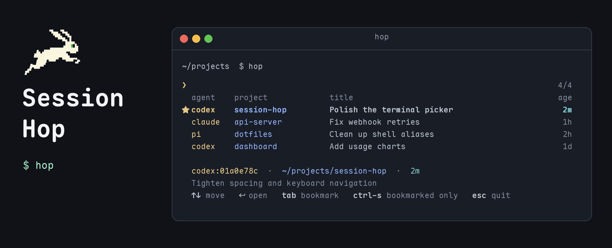

# Session Hop



Session Hop finds your local Pi, Claude Code, and Codex conversations across every project and puts you back in one. Type a few words, pick a session, press Enter, and you're in the right directory with the conversation resumed.

The command is `hop`. It reads the agents' session files and never changes them. It doesn't call an AI model or send anything over the network.

## Install

You need Python 3.11 or newer on macOS or Linux. There are no dependencies beyond the standard library.

```bash
git clone git@github.com:iodic/session-hop.git ~/sandbox/session-hop
ln -s ~/sandbox/session-hop/hop ~/.local/bin/hop
```

Any directory on your `PATH` works in place of `~/.local/bin`.

## Usage

Every command first scans for new and changed session files. The first scan reads everything and can take several seconds. Later scans read only files that changed, which is usually nothing. If a scan runs longer than 200ms, a progress line shows on stderr and clears before the picker opens.

Commands that act on one session, such as `bm`, `open`, and `rename`, take its session ID. The picker's footer shows the highlighted session's ID, like `pi:01a0da86`. You can type the full ID or any prefix of it that matches only one session. If a prefix matches more than one, make it longer or add the agent, as in `pi:01a0da86`, `claude:0c2f90be`, or `codex:01a0df43`.

### Browse everything

```bash
hop
```

`hop` on its own opens the picker with every session, newest first. Move to a session and press Enter to resume it.

### Search and resume

```bash
hop billbee
```

Add words to open the picker already filtered to sessions that contain all of them, in any order. Matching covers titles, descriptions, tags, IDs, agent names, and project paths. Keep typing to narrow the list, then press Enter to resume the highlighted session.

`hop pick billbee` is the same thing with the command spelled out. To search for a word that is also a command name, put `--` first:

```bash
hop -- sync
```

### Filter by project

```bash
hop billbee -p .
```

`-p` limits results to one project. A session's project is the Git checkout that contains its working directory, so sessions started in `src/` count toward the repository they belong to. A session outside any checkout uses its own directory. Your home directory never counts as a checkout, even if it holds a dotfiles repository.

A value that starts with `.` or `~` or contains `/` is a path, and `-p .` means the checkout you're standing in. Anything else matches project names:

```bash
hop -p fizzy
```

This shows sessions from every project whose name contains "fizzy".

### Show bookmarks

```bash
hop -b
```

`-b` opens the picker showing only bookmarked sessions. It combines with search words and `-p`. Inside the picker, Ctrl-S switches between bookmarked sessions and all of them.

### Bookmark a session

```bash
hop bm 01a0da86 "finish the tests"
```

This bookmarks the session whose ID starts with `01a0da86`. Bookmarks mark sessions you want to come back to. They show an `★` in the list. The note is optional; when you give one, it replaces the session's description. In the picker, Tab toggles the bookmark on the highlighted row.

```bash
hop unbm 01a0da86
```

`unbm` removes the bookmark from that session and leaves the note. The long forms are `bookmark` and `unbookmark`.

### Open a session by ID

```bash
hop open 01a0da86
```

`open` resumes the session whose ID starts with `01a0da86`, without the picker. It changes to the session's working directory, then runs the agent's own resume command:

| Agent | Resume command |
|---|---|
| Pi | `pi --session <session-file>` |
| Claude Code | `claude --resume <id>` |
| Codex | `codex resume <id>` |

### Rename a session

```bash
hop rename 01a0da86 "Fix Stripe webhooks"
```

This sets the title Session Hop shows for session `01a0da86`. The agent's own session name stays as it was. `title` is an alias for `rename`.

### Add a note

```bash
hop note 01a0da86 "Waiting on production credentials"
```

This adds a note to session `01a0da86`. The note replaces the description shown under the title, which is otherwise an excerpt of your messages.

### Tag a session

```bash
hop tag 01a0da86 payments
```

This tags session `01a0da86` with `payments`. Tags are extra search words. Each call adds tags; nothing removes them yet.

Titles, notes, tags, and bookmarks you set survive rescans.

### Rebuild the index

```bash
hop sync
```

Other commands scan on their own, so you rarely need this. `sync` scans and reports how many sessions it indexed and removed.

## The picker

The picker draws below your prompt, like `fzf --height`, and erases itself when you leave. The active row is bold, and the footer shows its ID, directory, age, and description. The count on the right is matches out of all sessions that pass `-p` and `-b`.

| Key | Action |
|---|---|
| Type | Filter the list |
| ↑ ↓, Ctrl-P Ctrl-N | Move |
| PgUp PgDn | Move a page |
| Backspace, Ctrl-W, Ctrl-U | Delete a character, a word, or the whole query |
| Tab | Toggle bookmark |
| Ctrl-S | Show only bookmarked sessions, or all again |
| Enter | Resume the session |
| Esc, Ctrl-C | Quit |

Colors come from your terminal's own palette, so the picker follows your theme when you switch it. Set `NO_COLOR` to turn them off.

The picker needs a terminal. From a script or a pipe, `hop` exits with an error, and `hop open <id>` resumes a session instead.

## What gets indexed

Session Hop reads these folders:

| Agent | Sessions | Titles |
|---|---|---|
| Pi | `~/.pi/agent/sessions` | Session name set in Pi |
| Claude Code | `~/.claude/projects` | Title set in Claude, then Claude's generated title |
| Codex | `~/.codex/sessions` | Thread name from `~/.codex/session_index.jsonl` |

A session with no name gets the start of your first message as its title. The description is a short excerpt of your messages, not a summary of the whole conversation.

Agents wrap your messages in extra text, such as skill definitions, slash-command tags, command output, and the instructions Codex adds to every conversation. Session Hop strips those before picking a title. A bare command like `/clear` or `/qa` is skipped in favor of your next message. If a session has nothing but the command, it takes the command as its title when the agent answered, and it's left out when the agent didn't, unless you bookmarked, renamed, noted, or tagged it.

Some sessions are skipped entirely. These are Claude sub-agent sessions, Codex sub-agents, one-off `codex exec` runs, archived Codex sessions, and early 2025 Codex files that don't record a working directory.

## The index

The index is an SQLite file at `~/.local/share/session-hop/index.sqlite3`, or under `$XDG_DATA_HOME` when that is set. An index from the tool's earlier name, `agent-sessions`, moves there on first run.

The index holds working directories and short excerpts of your messages, so treat it as private. Session Hop creates it with mode `0600`. It never stores full transcripts, tool output, or model responses.

When a session file disappears, the next scan drops its entry. If a whole source folder is missing, for example on an unmounted disk, its entries stay.

## Development

Run the tests from the repository root:

```bash
python3 -m unittest discover -s . -p 'test_*.py'
```

The tests build synthetic sessions in a temporary directory. To point `hop` at other data, pass `--db`, `--pi-dir`, `--claude-dir`, or `--codex-dir` before the command:

```bash
hop --db /tmp/hop-test.sqlite3
```
